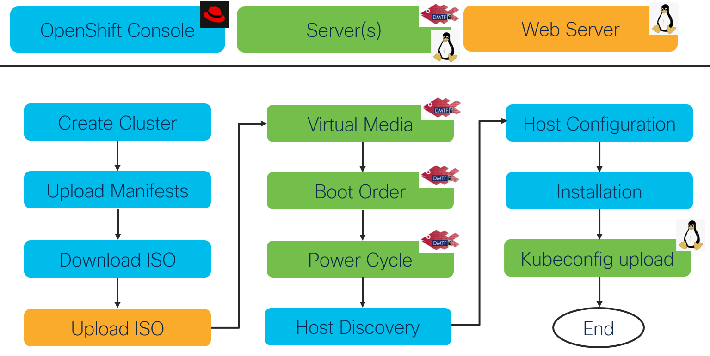

# OpenShift Installation

This repo contains templates of cluster, fabric and tasks definitions that can be used with [iserver](https://wwwin-github.cisco.com/emear-telcocloud/iserver/blob/master/doc/ocp/BareMetalCluster.md) to install OpenShift cluster on bare metal Cisco USC compute infrastructure.

## HowTo

Step 1: Clone this git repository.

Step 2: Copy cluster template directory that matches your deployment scenario to other location.

Step 3: Edit cluster definition files there. 

Step 4: (optional) Add [tasks](https://wwwin-github.cisco.com/emear-telcocloud/iserver/blob/master/doc/ocp/Operations.md) for post-installation cluster configuration.

Step 5: Deploy the cluster 

```
# iserver create ocp cluster bm --dir <directory> --mode install
```

## Templates

CNI | Nodes | Interface | All-in-one | File-per-section
--- | --- | --- | --- | ---
Cilium | 1 | Single | [Link](./cluster/sno-cilium-single-aio/) | [Link](./cluster/sno-cilium-single-files/)
Cilium | 1 | Bonded | [Link](./cluster/sno-cilium-bonding-aio/) | [Link](./cluster/sno-cilium-bonding-files/)
Cilium | 3 | Single | [Link](./cluster/3n-cilium-single-aio/) | [Link](./cluster/3n-cilium-single-files/)
Cilium | 3 | Bonded | [Link](./cluster/3n-cilium-bonding-aio/) | [Link](./cluster/3n-cilium-bonding-files/)
OVNKubernetes | 1 | Single | [Link](./cluster/sno-ovn-single-aio/) | [Link](./cluster/sno-ovn-single-files/)
OVNKubernetes | 1 | Bonded | [Link](./cluster/sno-ovn-bonding-aio/) | [Link](./cluster/sno-ovn-bonding-files/)
OVNKubernetes | 3 | Single | [Link](./cluster/3n-ovn-single-aio/) | [Link](./cluster/3n-ovn-single-files/)
OVNKubernetes | 3 | Bonded | [Link](./cluster/3n-ovn-bonding-aio/) | [Link](./cluster/3n-ovn-bonding-files/)

Notes:
- All files and manifests defining cluster installation intent must be in a single directory
- One-time [configuration](https://wwwin-github.cisco.com/emear-telcocloud/iserver/blob/master/doc/ocp/Console.md) of OpenShift Console authentication required.
- No support for 2 node cluster
- For 3+ cluster, start with 3 node template and add extra servers. Define [role property](https://wwwin-github.cisco.com/emear-telcocloud/iserver/blob/master/doc/ocp/bm/input_data_server_role.md) to assign servers to master or worker role
- Bonding support for two interfaces 
- [bonding.yaml](./bonding.md) and [single.yaml](./single.md) can be modified as required, make sure that variables [resolve](./variables.md)
- all templates define interface with vlan, refer to [single_no_vlan](./single_no_vlan.md) as example without vlan
- Cilium EE manifests must be unpacked into manifests subdirectory, they are modified by default, check [here](https://wwwin-github.cisco.com/emear-telcocloud/iserver/blob/master/doc/ocp/bm/cilium_fixup.md) for details
- you can add any custom yaml file to manifests as long as you keep one CRD per yaml file (no '---' in yaml)
- all templates use local web server, check [here](https://wwwin-github.cisco.com/emear-telcocloud/iserver/blob/master/doc/ocp/bm/input_data_web.md) to understand different web server deployment options
- the only difference between all-in-one and file-per-section templates is the number of definition files, 
    - in case of all-in-one, all definitions end up in cluster.json file;
    - in case of file-per-section, you have different pieces of configuration intent spread across files
- refer to [documentation](https://wwwin-github.cisco.com/emear-telcocloud/iserver/blob/master/doc/ocp/BareMetalCluster.md) for configuration syntax and options
- all templates define servers with direct redfish access, in case of FabricInterconnect refer to example below

```
      "redfish": {
          "endpoint_type": "fi",
          "inventory_type": "Server",
          "inventory_id": "ID-of-the-server",
          "endpoint_ip": "10.1.1.1",
          "endpoint_port": "443",
          "username": "admin",
          "password": "pass"
      },
```

Check inventory IDs using

```
$ iserver get redfish fi --ip 10.1.1.1 --username admin --password pass
+----------------+------------+---------------------+---------------------+--------------+---------------+----------------+
| Inventory Type | Chassis Id | Inventory Id (IOM1) | Inventory Id (IOM2) | Chassis Name | Chassis Model | Chassis Serial |
+----------------+------------+---------------------+---------------------+--------------+---------------+----------------+
| Chassis        | chassis-1  | IoCard-1-1          | IoCard-1-2          | my-name      | UCSX-9508     | my-serial      |
+----------------+------------+---------------------+---------------------+--------------+---------------+----------------+

+----------------+--------------+------------+--------------+---------------+
| Inventory Type | Inventory Id | Chassis Id | Server Model | Server Serial |
+----------------+--------------+------------+--------------+---------------+
| Server         | my-server1   | chassis-1  | UCSX-210C-M6 | my-serial1    |
| Server         | my-server2   | chassis-1  | UCSX-210C-M6 | my-serial2    |
| Server         | my-server3   | chassis-1  | UCSX-210C-M6 | my-serial3    |
| Server         | my-server4   | chassis-1  | UCSX-210C-M6 | my-serial4    |
+----------------+--------------+------------+--------------+---------------+ 
```

## Workflow

Simplified block diagram of OpenShift cluster installation workflow

